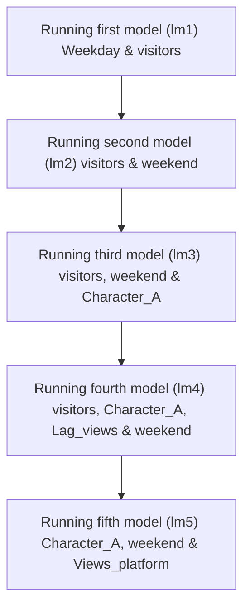

# Digital Media View Prediction Diagrams

Generated on 2026-04-26T04:17:39Z from repository evidence.

## Architecture Overview

```mermaid
flowchart LR
    A[Repository Inputs] --> B[Preparation and Validation]
    B --> C[ML Case Study Core Logic]
    C --> D[Output Surface]
    D --> E[Insights or Actions]
```

## Workflow Sequence

```mermaid
flowchart TD
    S1["Running first model (lm1) Weekday & visitors"]
    S2["Running second model (lm2) visitors & weekend"]
    S1 --> S2
    S3["Running third model (lm3) visitors, weekend & Character_A"]
    S2 --> S3
    S4["Running fourth model (lm4) visitors, Character_A, Lag_views & weekend"]
    S3 --> S4
    S5["Running fifth model (lm5) Character_A, weekend & Views_platform"]
    S4 --> S5
```
